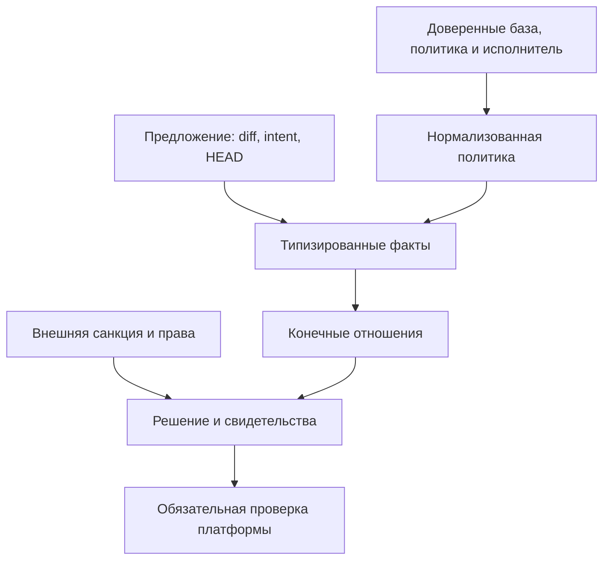

# Требования продукта repo-guard

Версия требований: **1.0.0**. Единственный нормативный источник назначения и требований самого продукта — этот документ в принятом коммите репозитория. Версия требований независима от версии пакета. Ветка PR содержит предложение; текущей authority оно становится только после санкционированного слияния с успешной независимой проверкой. История `Git` сохраняет точные принятые редакции; ссылка на изменяемый `main` не заменяет идентичность редакции.

Этот путь включён в `paths.governance_paths`. Изменение текста, удаление или переименование требует санкции доверенной стороны по базовой политике. Первичное принятие выполняется в рамках [#518](https://github.com/netkeep80/repo-guard/issues/518). Защита пути не доказывает качество содержания: его принятие остаётся ответственностью человека. Делегирование инструменту записи по явному указанию владельца не является независимым вторым одобрением.

## Назначение

**Сохранять человеческую authority над требованиями и принятым состоянием: независимо проверять границы предложенного изменения и наблюдаемые основания его принятия, оставляя человеку и ИИ свободу реализации внутри этих границ.**

Продукт нужен там, где предлагающий изменение не должен сам менять условия его допустимости. Он не заменяет интеллект исполнителя, предметное доказательство, ревью или защиту ветки платформой. Его ценность — независимая проверка объявленных границ и происхождения свидетельств, а не количество запретов.

## Иерархия

| Уровень | Роль | Источник |
| --- | --- | --- |
| `L0` | Назначение | Абзац выше |
| `L1` | Принципы | Человеческая authority; проверяемые утверждения; свобода внутри границ; минимальная стоимость |
| `L2` | Гарантии и ограничения продукта | `RG-01`–`RG-08` ниже |
| `L3` | Методика, пропорциональная риску | [Разработка по контракту](contract-development.md) |
| `L4` | Средства реализации | Доверенные входы, факты, отношения, санкции, обычный CI и настройки платформы |
| `L5` | Удобства | Пакеты политики, генерация начальных файлов, диагностика, проекции |

Нижний уровень не создаёт цель для верхнего. Полезность пакета или проверки сама по себе не обосновывает обязательность для всех потребителей. `MUST` означает обязательное требование, `SHOULD` — предпочтение с обоснованным исключением, `MAY` — допустимую возможность. Требования к конкретной защите действуют при её явном выборе; отсутствие настройки нельзя выдавать за реализованную гарантию.

## Восемь требований

### RG-01 — Независимая authority

**`MUST`:** намерение изменения не выдаёт разрешение менять правила управления. Решение о такой допустимости опирается на доверенное состояние и санкцию вне проверяемого PR. Неизвестная или недоступная authority не считается разрешением.

Риск — исполнитель переписывает критерии своей приёмки. Нарушение — разрешение выводится только из PR, его изменённого кода проверки, метки или отсутствия данных. Машинно проверяются источник политики, путь санкции и положительное право доверенной стороны; осмысленность человеческого решения машиной не доказывается.

Средства: доверенная `BASE`, `GovernanceGrant`, защищённые пути, независимый производитель обязательного статуса, защита ветки. Самоприменение использует отдельное приложение для `trusted-enforcement`. Потребитель должен настроить такой контур отдельно. Агент с теми же административными полномочиями, что владелец, находится вне этой модели угроз.

### RG-02 — Принятие не выводится из готовности

**`MUST`:** там, где проект различает кандидата и принятое поведение, переход требует отдельного наблюдаемого решения уполномоченной стороны, связанного с точной редакцией и её свидетельствами. Зелёный CI, слияние исследовательского кода, закрытая задача и номер пакета сами по себе не означают принятия предметного контракта.

Риск — эксперимент незаметно становится текущей семантикой. Нарушение — потребитель выбирает кандидата как принятое состояние без предусмотренного перехода. Статусы и ссылки проверяемы данными; полнота предметной приёмки требует внешних проверок и решения владельца.

Средства: защищённые документы жизненного цикла, отношения документов, отдельная санкция перехода, точные ссылки. `contract-conformance` проверяет настроенные структурные условия, но сам не выдаёт полномочие принять контракт. Исторический снимок исследования `anum_docs`, использованный при формировании требования, показывал сосуществование принятого `v0.11` и кандидата `v0.12`; это пример разделения состояний, а не утверждение о текущем статусе внешнего проекта.

### RG-03 — Ограниченные и раздельные полномочия изменения

**`MUST`:** явно выбранная граница изменения должна охватывать затронутую authority, включая прежний путь при переименовании. Разрешение менять одну область не распространяется автоматически на соседнюю. Ограничения из непривилегированного намерения не расширяют доверенные потолки.

Риск — переименование или совместное изменение позволяет пересечь запрет. Нарушение — тот же защищаемый объект можно изменить через другое имя либо повышение бюджета в PR. Машинная проверяемость высокая для путей и числовых потолков; путь сам по себе не доказывает семантическую независимость модулей.

Средства: `scope`, `must_not_touch`, потолки политики, governance, `pr_immutable`; для постоянной границы нужна доверенная политика, поскольку сам автор может переписать своё намерение. В `anum_parser` независимость семантического и визуального пакетов дополнительно проверялась точными зависимостями и предметным CI. Доказанный дефект `rename-away` обычного намерения закрыт в #568: `scope` и `must_not_touch` учитывают прежний путь, тогда как положительная семантика `must_touch` намеренно не менялась.

### RG-04 — Свидетельство соответствует утверждению

**`MUST`:** результат сообщает проверенное ограничение, идентичность входов, наблюдение и предел вывода. Отсутствующее свидетельство нельзя называть успехом. **`SHOULD`:** для существенной гарантии иметь положительный пример и контрпример с ожидаемой причиной отказа.

Риск — зелёный цвет, наличие тестового файла или изменение соседнего файла подменяет доказательство поведения. Нарушение — заявленная гарантия шире реально проверенного предиката. Машинно проверяются объявленные значения и связи; содержательность теста требует предметной проверки.

Средства: машинный отчёт, диагностика отношений, исполняемые сценарии, предметные тесты, точные ссылки на запуски. Отрицательный свидетель может успешно доказать существование пробела: в `anum_docs` тест проходит, утверждая, что текущая реализация ещё не удовлетворяет кандидату. `cochange` не доказывает запуск или релевантность теста.

### RG-05 — Воспроизводимое происхождение authority

**`MUST`:** если утверждение зависит от внешней семантики или артефакта, оно указывает именно проверенную принятую идентичность; кандидат и плавающая ссылка не выдаются за точный принятый источник. Разные authority фиксируются независимо. Осознанный выбор плавающей зависимости должен быть явным.

Риск — проверено одно, исполнено или принято другое. Нарушение — одного имени версии достаточно для заявления о совпадении контракта, исходников и артефакта. Машинно проверяются точные коммиты, значения контрактов, хеши и доступная история происхождения; это не автоматическое доказательство воспроизводимой сборки.

Средства: отношения документов и внешние проверки зависимостей/артефактов. В `aprover` обычный CI материализует точный `@mts/core` и проверяет пакет; в `anum_parser` отдельны семантическая и визуальная фиксации. Выпуск самого инструмента связывает точный принятый коммит с тегом и объектом выпуска.

### RG-06 — Постепенное подключение и честный охват

**`MUST`:** сложная контрактная методика включается явно; обнаружение существующих контрактов может предложить настройку, но не включать новые блокировки молча. Начальная конфигурация и диагностика не должны обещать неустановленную защиту. **`SHOULD`:** цена первого полезного ограничения мала.

Риск — процессный барьер без пользы либо ложное ощущение защищённости. Нарушение — маленький проект обязан создать искусственный контракт или получает заявление о защите слияния без проверки платформы. Машинно проверяемы создаваемые файлы, режим и доступные настройки; выбор нужной зрелости принадлежит владельцу.

Средства: явный `advisory`, начальные настройки, `doctor`, короткие примеры. `init` по-прежнему по умолчанию создаёт `blocking`, поэтому безопасное постепенное подключение требует явно выбрать `advisory`. `doctor` теперь только для чтения наблюдает защиту ветки и обязательные статусы, включая доступные `app_id`, но не настраивает платформу и не решает за владельца, какой производитель статуса является доверенным.

### RG-07 — Свобода реализации и правильный владелец проверки

**`MUST`:** продукт ограничивает наблюдаемый результат и полномочия, не навязывает последовательность программирования. Проверку, которую лучше выполняют платформа, компилятор или предметный CI, не следует дублировать более слабым блокирующим аналогом без независимой ценности.

Риск — историческая форма реализации и ручная церемония становятся целью. Нарушение — корректное изменение отклоняется только из-за необоснованного числа файлов, формы теста или порядка работы. Проверяемы конкретные дублирующие пути исполнения; оценка независимой ценности остаётся архитектурным решением.

Средства: небольшие декларативные границы, внешние предметные свидетельства, факультативные бюджеты и подсказки. В `anum_parser` тест постоянного числа узлов сохранял дефект визуализации; правильный контракт разрешил изменить реализацию. В `aprover` честный `GAP` предпочтительнее локального обхода отсутствующей upstream-возможности.

### RG-08 — Самоупрощение вместо накопления возможностей

**`MUST`:** новая блокирующая возможность или публичное понятие обосновывается требованием `RG-*`, реальным неудовлетворённым случаем, независимой ценностью и сравнением с более простым решением. Равная гарантия при меньшей суммарной стоимости предпочтительна. **`SHOULD`:** удалять лишнее, переиспользовать и сводить удобства к существующему ядру до добавления семантики.

Риск — продукт становится процессным надзирателем. Нарушение — задача принимается только потому, что проверка локально полезна, увеличивает покрытие самоприменением или уменьшает одну метрику ценой новых понятий. Автоматизировать можно измерения; решение о необходимости не заменяется числом строк.

Средства: [единый план #518](https://github.com/netkeep80/repo-guard/issues/518), шаблон обоснования в методике, реальные внешние контрпримеры, измерения стоимости. Отсутствие нового свидетельства — достаточное основание не реализовывать предложение. Удаление возможности является полноценным улучшением.

## Архитектура и владение проверками

Проверяемые документы PR — данные, а не исполняемая authority. Высокоуровневые правила и закрытый набор пакетов сводятся к `Constraint Program`; `FactRef` адресует конечные источники фактов, `primitive_relation` использует существующее ядро отношений. Санкция и происхождение доверенных входов остаются отдельной границей: превращение их в произвольные данные кандидата уничтожило бы независимость.

Адаптеры `CLI` и действия собирают контекст; они не должны иметь разные значения одной политики. Обычный CI владеет исполнением тестов и сборкой. Платформа владеет запретом слияния/прямой записи. Предметный проверяющий механизм владеет корректностью математического доказательства, интерпретатора или изображения. `repo-guard` связывает только явно объявленные наблюдения и границы. Совместная система может дать больше гарантий, чем один её компонент.

## Классификация возможностей

| Возможность | Роль и требование | Решение |
| --- | --- | --- |
| Доверенная база, независимая проверка, санкция | `TRUST / SECURITY`, `RG-01` | Сохранить; не ослаблять ради удобства |
| Защищённые пути, запрет ослабления, атомарный переход | `CORE / MUST KEEP`, `RG-01/02/03` | Сохранить точную санкцию; переход не освобождает остальные обязательства |
| `pr_immutable` | `TRUST / SECURITY`, `RG-03` | Сохранить как отдельную строгую границу PR; не включать всем |
| `ChangeIntent.scope`, `must_not_touch` | `CORE`, `RG-03` | Сохранить границу переименования, учитывающую прежний и новый путь |
| `must_touch`, `cochange` | `CONTRACT DEVELOPMENT`, `RG-04` | Оставить опциональными структурными свидетельствами |
| Бюджеты, пределы изменения/размера | `ADVISORY` по умолчанию выбора, `RG-03/07` | Блокировать лишь при независимом обосновании ресурса/границы; текущее исполнение не меняется |
| `expected_effects` | `AGENT GUIDANCE`, `RG-07` | Описание для ревью; кандидат на необязательность без новой семантики |
| Якоря и отношения документов | `CONTRACT DEVELOPMENT`, `RG-02/04/05` | Переиспользовать по потребности, не требовать от каждого проекта |
| `contract-conformance` | `CONTRACT DEVELOPMENT`, `RG-02/04` | Закрытый пакет структурных связей; предметная истина остаётся снаружи |
| `version-governance` | `CONTRACT DEVELOPMENT`, `RG-05` | Только для заявленного перехода; не заставлять каждый PR повышать версию |
| Защита рабочего процесса, точная ссылка действия | `TRUST / SECURITY`, `RG-01/05` | Сохранить; обязательность статуса настраивает платформа |
| Проверки содержимого | По предикату: граница либо `CI-NATIVE` | Не копировать форматтер/линтер; эвристики сходства — подсказка |
| Самоприменение | Свидетельство, `RG-04/08` | Проверять реальные обязанности; разрешать честные исключения |
| Метрики сжатия | `ADVISORY`, `RG-08` | Наблюдение стоимости; не автоматическая цель качества |
| Обсерватория | Производная информационная проекция, `RG-04` | Не источник принятия и не блокирующий механизм продукта |
| Проверка выпуска | `TRUST / SECURITY`, `RG-05` | Сохранить точную цель и независимую проверку |
| Ручное копирование доступных платформе идентификаторов | `LEGACY / DELETE CANDIDATE`, `RG-07/08` | Убирать дубли; сохранять лишь идентичность решения, которой нет в источнике |

## Где блокировать

**Обязательный отказ:** неизвестная authority, неразрешённое изменение правил, нарушение настроенной границы, подмена принятого источника, отсутствие обязательного свидетельства при заявлении готовности. Нельзя делать такие нарушения рекомендацией только из-за статуса черновика.

**Рекомендация:** эвристика качества, необоснованный локальный бюджет, неполная исследовательская работа без заявления принятия. **Информация:** метрики, проекции, состояние опубликованного выпуска. Если рабочий процесс пока использует информационную проекцию как условие выпуска, это его текущая процедура, а не фундаментальная гарантия продукта; её удаление требует отдельного доказательства эквивалентности.

Целевая фазовая семантика: черновик допускает явно обозначенную неполноту; готовый PR означает, что его точное состояние предъявлено для приёмки; принятый коммит требует собственных свидетельств после слияния. Это методика, не обещание автоматического переключения всех уровней проверки. В собственном репозитории обычная PR-проверка и `trusted-enforcement` пропускают черновики; изменения тела готового PR переоцениваются событием `edited`. Изменение тела связанной задачи не выдаёт новый вердикт: доверенный контур только переводит прежний `trusted-enforcement` в `pending`, после чего свежий успех или отказ может дать лишь обычный оценщик PR. Дрейф базы делегирован настроенной защите ветки, которая делает PR `behind`. Генерируемый `init` потребительский workflow уже этого полного контура не обещает.

## Границы текущей реализации

Этот раздел описывает действующие границы реализации той же редакции требований. Точная идентичность реализации задаётся принятым коммитом, содержащим этот документ; исторические контрпримеры сохраняются в связанных задачах, но не выдаются за открытые дефекты.

- Доказанный дефект `rename-away` #568 закрыт: `scope` и `must_not_touch` используют прежний и новый путь переименования. `must_touch` остаётся положительным свидетельством по текущему пути и не был расширен как побочный эффект.
- Источник `GovernanceGrant` — текущее тело однозначно связанной задачи и наблюдаемые при оценке права её автора. Это не подписанная неизменяемая санкция на конкретный `HEAD`, не срок действия и не отдельная проверка личности каждого редактора тела. Последующее изменение `repository permissions` автора само по себе сейчас не имеет отдельного lifecycle-триггера; ретроактивный отзыв ранее проверенного статуса не является заявленной гарантией.
- В собственном доверенном контуре изменение тела PR запускает новую оценку. Изменение тела связанной задачи консервативно инвалидирует старый `dedicated status` в `pending`; новый `GREEN/RED` публикует только обычный оценщик PR. Дрейф `main` не обслуживается scheduler'ом: при включённом требовании актуальной ветки платформа переводит PR в `behind`.
- `init` создаёт четыре файла и по умолчанию выбирает `blocking`. Его потребительский workflow обрабатывает `opened`, `synchronize`, `reopened`, `ready_for_review`, но не создаёт `dedicated trusted producer`, не обрабатывает `edited` или `issues: edited` и не меняет `branch protection`. Полный контур подключается отдельно по [руководству](trusted-deployment.md).
- `doctor` только для чтения наблюдает режим политики, защиту ветки и доступные `required status checks` с `app_id`. Он не меняет настройки, не доказывает успешное выполнение статуса на конкретном `HEAD` и не определяет автоматически, какой `app_id` владелец считает доверенным.
- Отношения и пакеты подтверждают только настроенные предикаты; они не исполняют произвольную предметную проверку. Наличие `blocking` workflow у потребителя без реально обязательного барьера слияния нельзя выдавать за независимый запрет обхода.

Развитие ведётся через [#518](https://github.com/netkeep80/repo-guard/issues/518). Новая реализация допускается только по новому воспроизводимому контрпримеру, явному требованию к жизненному циклу authority или реальному пробелу потребителя; закрытые исторические дефекты не являются основанием расширять продукт повторно.

## Изменение самих требований

Предложение должно назвать изменяемое требование, наблюдаемую проблему, альтернативы, влияние на существующие гарантии и способ опровержения. Изменение обязательств требует новой версии документа и санкции по действующей базовой политике; редакционная правка без изменения смысла не требует нового номера. Исторические редакции сохраняются в Git.

Для несовместимого ослабления нужен явный разбор замены гарантии; удобство или зелёные тесты не являются разрешением. Документ не создаёт новый формат политики, `DSL` или второй план развития. Публичная схема остаётся источником истины для формы данных, этот документ — для целей, а [методика](contract-development.md#развитие-самого-repo-guard) задаёт короткую процедуру доказательства необходимости.
